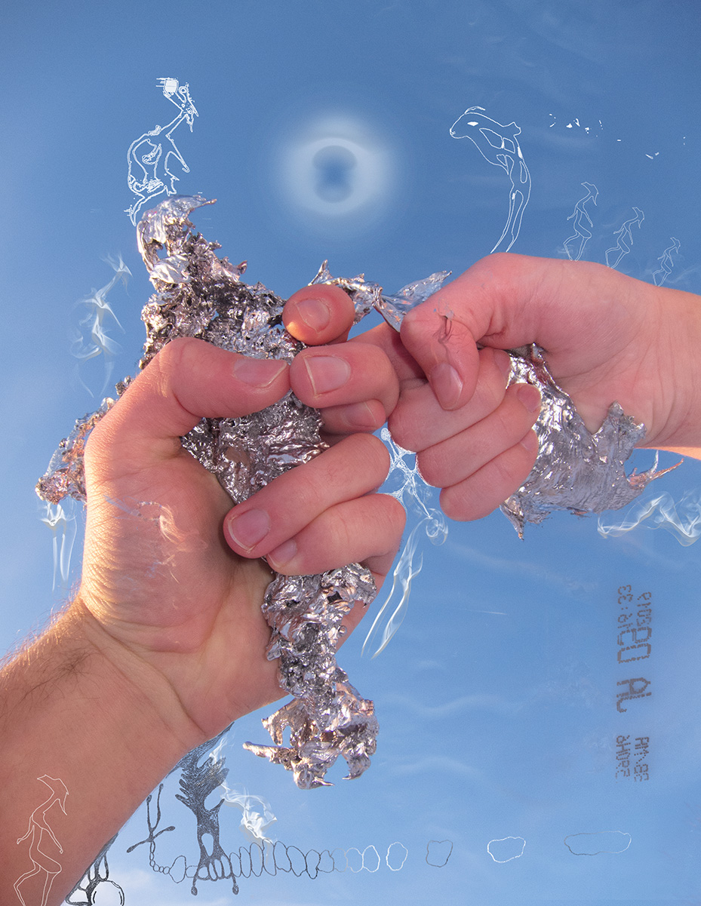
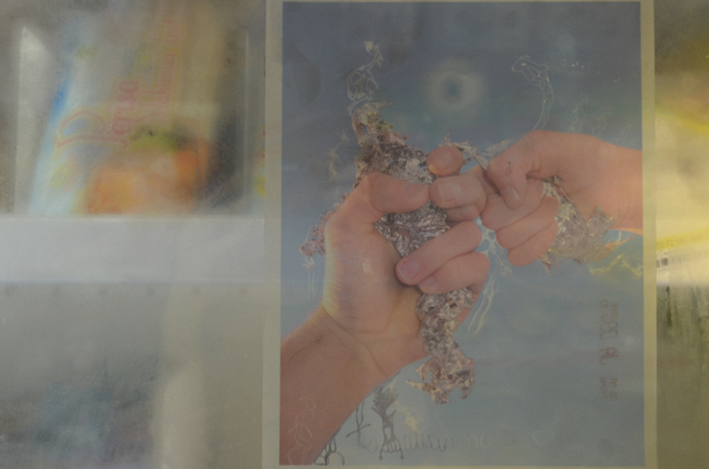

<html>

  <iframe width="100%" height="300" scrolling="no" frameborder="no" allow="autoplay" src="https://w.soundcloud.com/player/?url=https%3A//api.soundcloud.com/tracks/655004264&color=%23ff5500&auto_play=false&hide_related=true&show_comments=true&show_user=true&show_reposts=false&show_teaser=false&visual=true"></iframe>

  
I recently made a mixtape to explore the sound of life throbbing on a damaged planet; the sound of entire worlds rising and falling, screaming out of grief and elation.

  
  

  
My family and I created this digital drawing that was later <a href="http://undergroundflower.com/snapdragon.html" target="_blank">exhibited inside a corner store</a> in Ho Chi Minh City, Vietnam. In the image, you can see my sister and I holding the remnants of an ancient tradition in which molten lead is cast into cold water and used to foretell our family's fate for the new year.

In 2017 I performed a series of LARPed rituals with my sister and various other collaborators. Documentation from these experiences was exhibited in <a href="https://thewrong.org/about" target="_blank">The Wrong New Digital Art Biennale</a> in Hong Kong and Seoul, and was also featured on <a href="https://www.aqnb.com/2017/11/15/why-do-we-appropriate-life-hacking-into-taught-identity-with-fantasy-direct-group-show-at-seouls-yongma-charm-space/" target="_blank">AQNB</a> and <a href="http://tzvetnik.online/portfolio_page/fantasy-direct-yongma-land-charm-space/" target="_blank">Tzvetznik.</a>

<iframe class="lazy" width="100%" height="300" scrolling="no" frameborder="no" allow="autoplay" data-src="https://w.soundcloud.com/player/?url=https%3A//api.soundcloud.com/playlists/649914882%3Fsecret_token%3Ds-ZrJ5M&color=%23ff5500&auto_play=false&hide_related=false&show_comments=true&show_user=true&show_reposts=false&show_teaser=true&visual=true"></iframe>

I sometimes craft noise music and mixtapes under the alias of <a href="https://soundcloud.com/destroyer_12" target="_blank">DESTROYER_12</a>. Humans have described this work as "ecological <a href="https://en.wikipedia.org/wiki/Gabber" target="_blank">gabber</a>" and "music that guides the listener through the portals of liminality". My music has been released by <a href="https://bratrecords.bandcamp.com/album/brat-compilation-volume-2-vesna" target="_blank">BRAT Records</a> and has been featured in <a href="https://soundcloud.com/discmagazine/disc-024-floating-rooftop-healing-mix-destroyer_12" target="_blank">Disc Magazine</a>.

<iframe class="lazy" data-src='https://www.youtube.com/embed/Kb0CDXasjiE' frameborder='0' title ='0' allowfullscreen modestbranding='1' showinfo='0'></iframe>

<iframe class="lazy" data-src='https://www.youtube.com/embed/p-NkMdxFHtY' frameborder='0' title ='0' allowfullscreen modestbranding='1' showinfo='0'></iframe>

<iframe class="lazy" data-src='https://www.youtube.com/embed/d4KXmJRE3HU' frameborder='0' allowfullscreen></iframe>

I <a href="https://www.youtube.com/playlist?list=PLPn69OMwH-byEcKC3_Rthq6Il8-PevHgB" target="_blank">collect videos</a> of non-human forces including air compressors singing in unison, nibbling mice, and dandelion seeds self-organizing in the wind.

<iframe class="lazy" data-src='https://www.youtube.com/embed/R61n22gTkdo' frameborder='0' title ='0' allowfullscreen modestbranding='1' showinfo='0'></iframe>

In 2017 I made a 360º video about blue pandas from outer space, emergent lifeforms, and non-linear love. The soundtrack was composed using crowdsourced audio recordings collected from fifty classmates and family members. <a href="https://soundcloud.com/exilevevo/i-may-not-be-ready-2-shit-out-a-liquid-diamond-and-share-it-but-i-can-try-kenji-remix" target="_blank">Remixed by Kenji Yamamoto.</a>

In 2016 I had <a href="https://gaertnergasse.com/2018/every-day-is-a-lifetime/" target="_blank">a solo exhibition</a> at <a href="http://gaertnergasse.com/" target="_blank">Gärtnergasse</a>, an artist-run gallery in Vienna, Austria.

In 2015 I had a solo exhibition in an abandoned building in Toronto, Canada.

Many years ago I regularly took photographs. This work has been exhibited at the <a href="http://i-p-f.org/" target="_blank">Independent Photography Festival</a> in Melbourne, Australia and has been published by Incandescent Zine, CZE magazine, lightrad.ius, Waterfall Zine, and Camera Diynamite.

</html>

<!-- <html>

<section class="projects">

  <article class="grid-section">

  <figure class="grid-object-other">
       
          
I collect knowledge about the history and future of computation. I store this knowledge in a research channel named <a href="https://www.are.na/raul-altosaar/embodied-computation" target="_blank" title="Embodied Computation">Embodied Computation</a> on are.na. 

  </figure>

  <figure class="grid-object-other">
       
          
In 2017 I performed a series of virtual reality rituals with various collaborators. Documentation from these rituals was exhibited in The Wrong New Digital Art Biennale in Hong Kong and Seoul, Korea. Featured on<a href="https://www.aqnb.com/2017/11/15/why-do-we-appropriate-life-hacking-into-taught-identity-with-fantasy-direct-group-show-at-seouls-yongma-charm-space/" target="_blank" title="Embodied Computation"> AQNB</a> and <a href="http://tzvetnik.online/portfolio_page/fantasy-direct-yongma-land-charm-space/" target="_blank">Tzvetznik.</a>

  </figure>

  <figure class="grid-object-other">
       <iframe width="100%" height="450" scrolling="no" frameborder="no" allow="autoplay" src="https://w.soundcloud.com/player/?url=https%3A//api.soundcloud.com/playlists/649914882%3Fsecret_token%3Ds-ZrJ5M&color=%23ff5500&auto_play=false&hide_related=false&show_reposts=false&show_teaser=true&visual=true"></iframe>
          
I have been intermittently crafting noise music and mixtapes under the alias of <a href="https://soundcloud.com/destroyer_12" target="_blank">DESTROYER_12</a> for the past four years. Critics have described these productions as "ecological <a href="https://en.wikipedia.org/wiki/Gabber" target="_blank">gabber</a>" and "music that guides the listener through the portals of liminality". This work has been released by <a href="https://bratrecords.bandcamp.com/album/brat-compilation-volume-2-vesna" target="_blank">BRAT Records</a> and has been featured in <a href="https://soundcloud.com/discmagazine/disc-024-floating-rooftop-healing-mix-destroyer_12" target="_blank">Disc Magazine</a>. 

  </figure>

  <figure class="grid-object-other">
    
    
In 2017 I made <a href="https://www.youtube.com/watch?v=R61n22gTkdo" target="_blank">a 360º artwork</a> about emergent lifeforms and non-linear love. The soundtrack was composed using crowdsourced audio recordings collected from fifty classmates and family members. Featured in <a href="http://simforart.blogspot.com/2017/05/raul-altosaar-worm-video-1-injected-i.html" target="_blank">Sim Magazine</a> and <a href="https://soundcloud.com/exilevevo/i-may-not-be-ready-2-shit-out-a-liquid-diamond-and-share-it-but-i-can-try-kenji-remix" target="_blank"> remixed by Kenji Yamamoto.</a>

  </figure>

  <figure class="grid-object-other">
  	
		
In 2016 I had <a href="http://gaertnergasse.com/every-day-is-a-lifetime/" target="_blank">a solo exhibition</a> at <a href="http://gaertnergasse.com/" target="_blank">Gärtnergasse</a>, an artist-run space in Vienna, Austria.

  </figure>

  <figure class="grid-object-other">
  	
  	
Many years ago I regularly took photographs. This work has been exhibited at the <a href="http://i-p-f.org/" target="_blank">Independent Photography Festival</a> in Melbourne, Australia and has been published by Incandescent Zine, CZE magazine, lightrad.ius, Waterfall Zine, and Camera Diynamite.

  </figure>

</article>
</section>
</html> -->