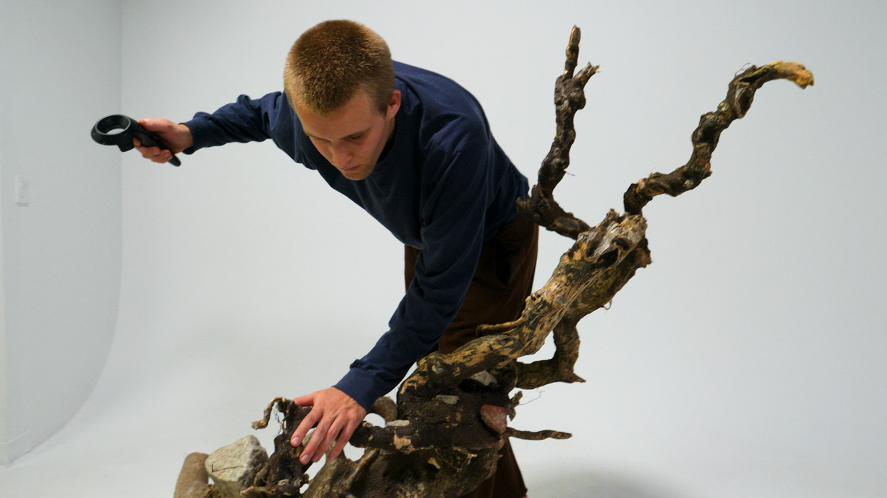
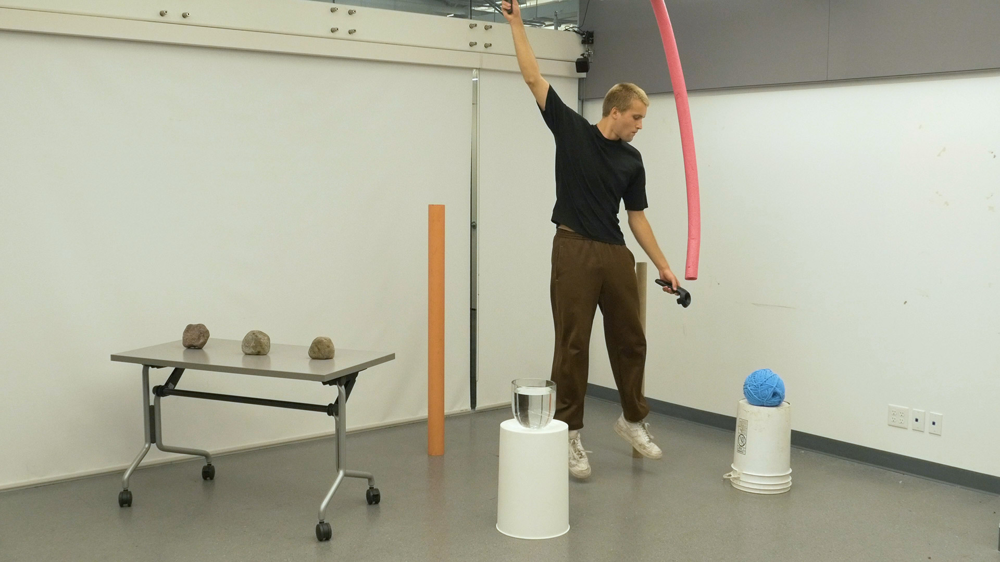
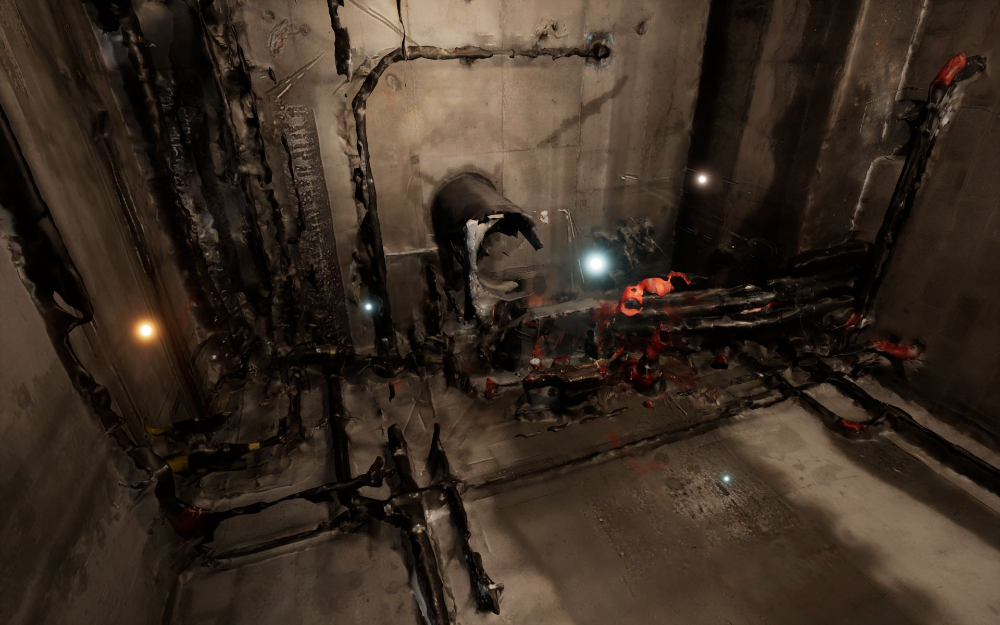
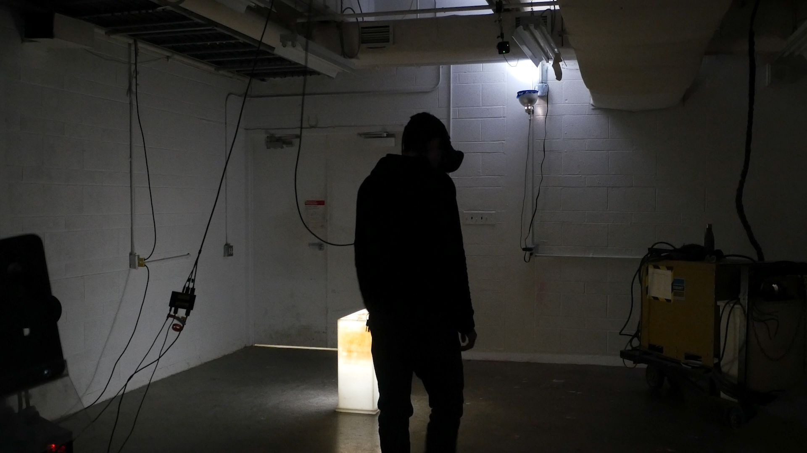
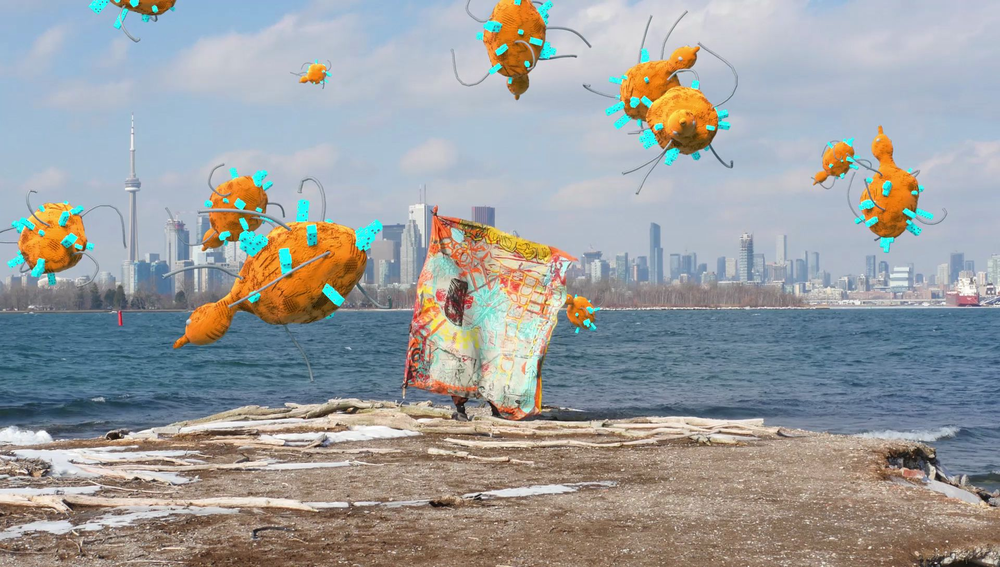

<html>

<a href="/live">

<h2 class="arrow">Live.</h2>

<h3>A series of live performances crafted using the Looper and detritus scavenged from industrial wastelands.</h3>

</a>

<a href="/a-very-real-looper">

<h2 class="arrow">A Very Real Looper</h2>

<h3>A custom musical interface built using a repurposed VR system. Sound can be placed anywhere in physical space using the Looper. Music is then performed by touching objects and jumping around wildly.</h3>

</a>

<a href="/liquefied-realities">

<h2 class="arrow">Liquefied Realities</h2>

<h3>I invited some computer vision algorithms to visit underground construction sites and abandoned factories with me. Together, we created this interactive VR environment. </h3>

</a>

<a href="/disintegration">

<h2 class="arrow">Disintegration</h2>

<h3>A mixed reality installation in which viewers physically navigated a virtual environment filled with decrepit machines and starfields.</h3>

</a>

<a href="/gesture-cloud">

<h2 class="arrow">Gesture Cloud</h2>

<h3>Volumetric videos converted into animated point clouds and staged in a virtual reality environment.</h3>

</a>

<a href="/alliance">

<h2 class="arrow">Alliance</h2>

<h3>A speculative AR application designed to reveal non-human forces in urban wastelands.</h3>

</a>

</html>